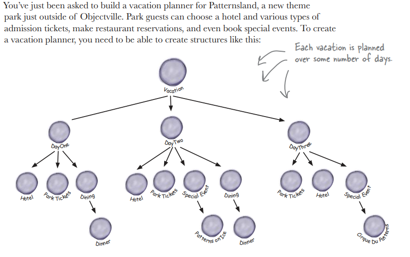
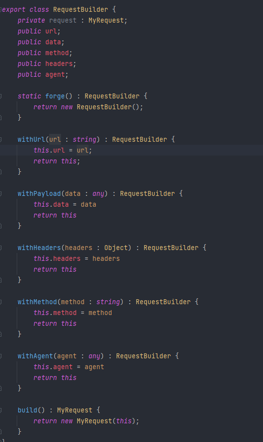
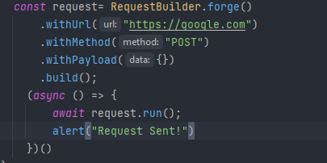

# Builder

> way a complex object is
constructed (برای وقتی که میخواید آبجکت های پیچیده بسازید)

> میتونیم آبجکت پیچیده ای که داریم رو توی چند مرحله با توجه به نیازمون پیاده سازی کنیم

###  کاربرد های بیلدر
* میتونی بگی این کد ها رو میخوای و این کد ها رو نمیخوای
* میتونی شکل های مختلفی رو برای ساخت آبجکتت پیاده سازی کنی
* میتونیم سیستم های درخت وار رو بسازیم

مثلا :
* Request 
* Proto 
* Test entities

یا مثلا شما میخواین یک اپلیکیشن برای برنامه ریزی تفریحات آخر هفته بنویسید که نیاز دارین یک آبجکت بزرگ و پیجیده برای تفریحاتتون بسازید

<h2>❌الان این مشکل رو داریم❌</h2>

DirtyPerson میخوایم یک آبجکت بسازیم به نام
 
که آبجکت پیچیده ای هستش و انواع مختلفی داره که مثلا توی این مثال برای اینکه بتونیم انواع مختلفش رو بسازیم انواع فانکشن رو برای ساختنش پیاده سازی کرده

<h2>✅حالا با استفاده از بیلدر به این کد میرسیم✅</h2>

### و به این راحتی ازش استفاده میکنیم

