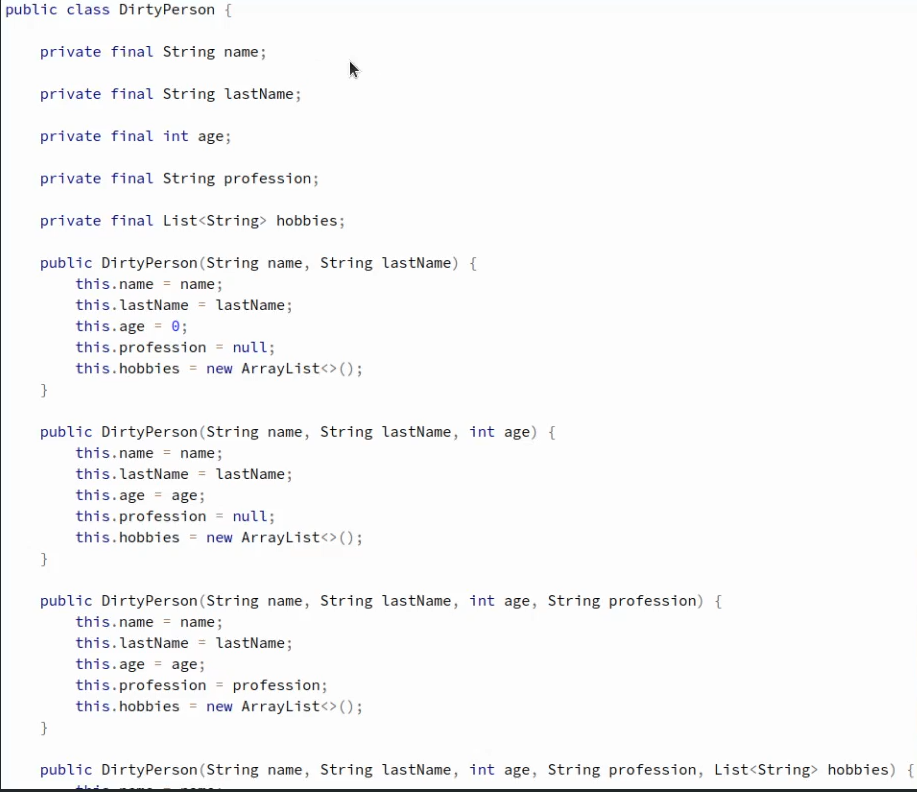

# Builder

> builder using to make complex object (برای وقتی که میخواید آبجکت های پیچیده بسازید از بیلدر استفاده میکنید)

مثلا :
* Request 
* Proto 
* Test entities

<h2>❌الان این مشکل رو داریم❌</h2>

### Applicability : کاربرد های بیلدر
* میتونی بگی این کد ها رو میخوای و این کد ها رو نمیخوای
* میتونی شکل های مختلفی رو برای ساخت آبجکتت پیاده سازی کنی
* میتونیم سیستم های درخت وار رو بسازیم
