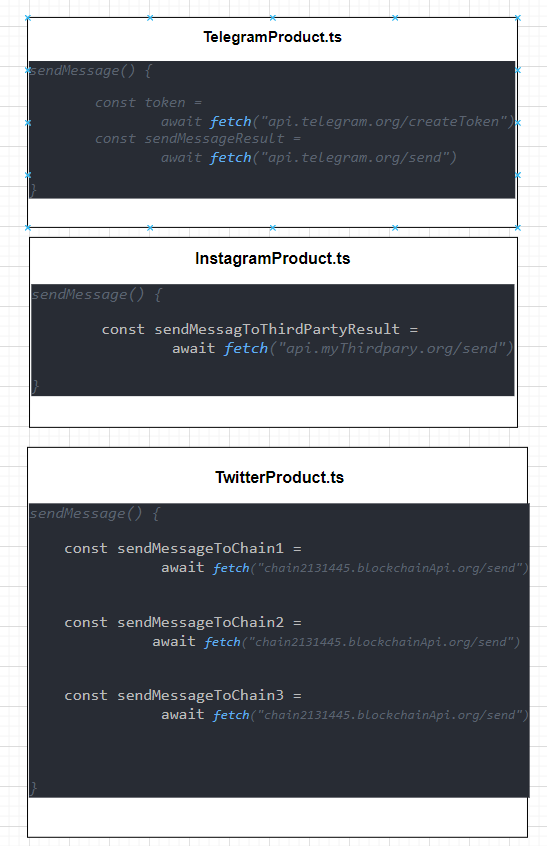
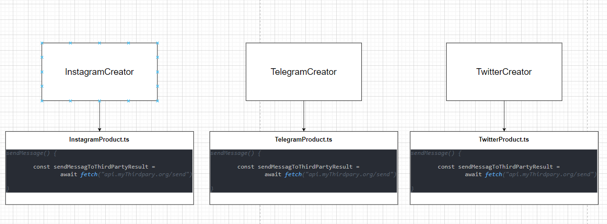

#- (factory-example) Publisher Application

### چالش : یک پروژه ای داریم که میخواد پیام خوش آمد گویی بعد از ثبت نام رو به پیامرسان های مختلف ارسال کنه
> نکته : هر پیامرسان پیاده سازی و وب سرویس های مخصوص خودش رو داره

> نکته : پیاده سازی وبسرویس پیامرسان ها **هیچ شباهتی به همدیگر ندارن**


## فانکشن زیر را داریم :

```js
    async function sendRegisterMessage(messengerName : "TELEGRAM" | "INSTAGRAM" | "TWITTER") {
        switch(messengerName) {
            case "TELEGRAM" :
                const token = await fetch("api.telegram.org/createToken")
                const sendMessageResult = await fetch("api.telegram.org/send") 
                break;
            case "INSGTAGRAM" :
                const sendMessagToThirdPartyResult = await fetch("api.myThirdpary.org/send")
                break;
            case "TWITTER" :
                const sendMessageToChain1 = await fetch("chain2131445.blockchainApi.org/send")
                const sendMessageToChain2 = await fetch("chain1313.blockchainApi.org/send")
                const sendMessageToChain3 = await fetch("chain11.blockchainApi.org/send")
                const sendMessageToChain4 = await fetch("chain66.blockchainApi.org/send")
                break;
        }
    }
```

#مرحله اول : Product


#مرحله دوم : Factory


#مرحله سوم : Factory
