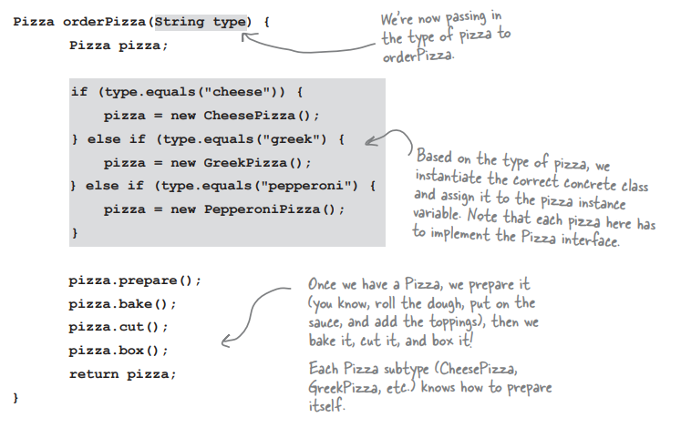
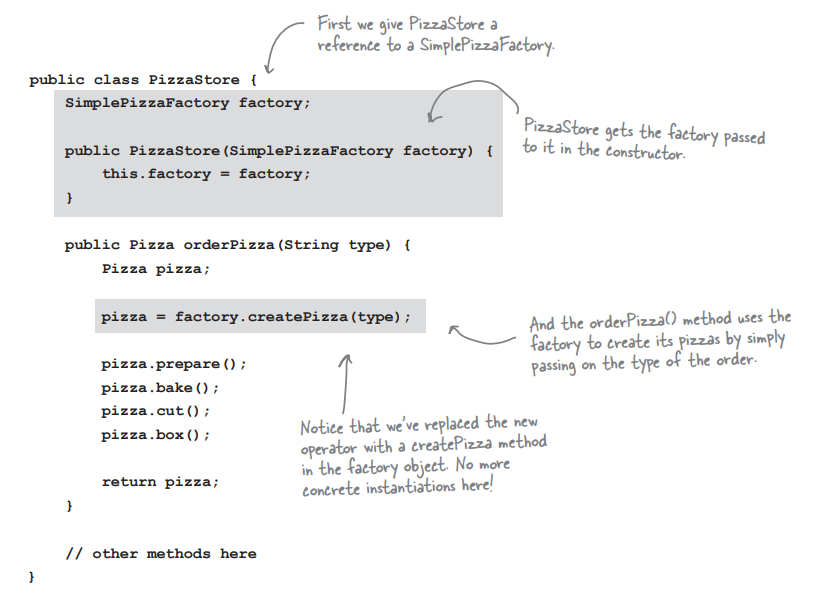
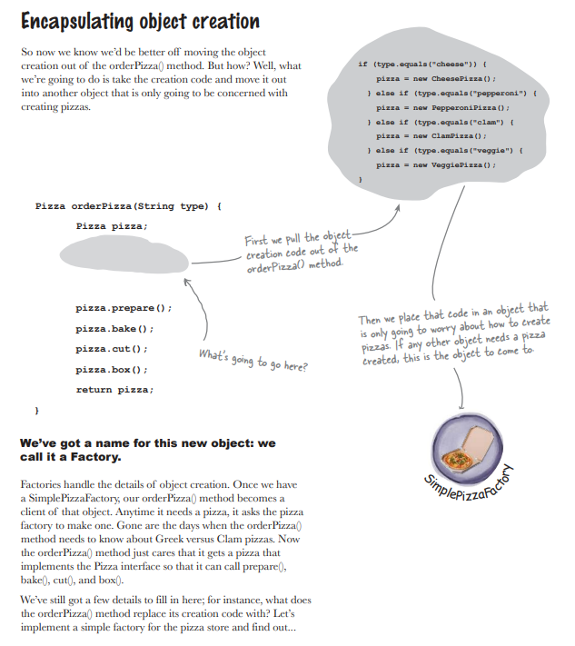
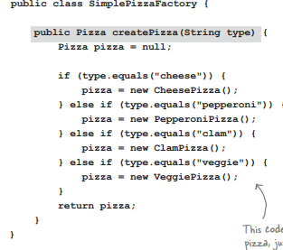
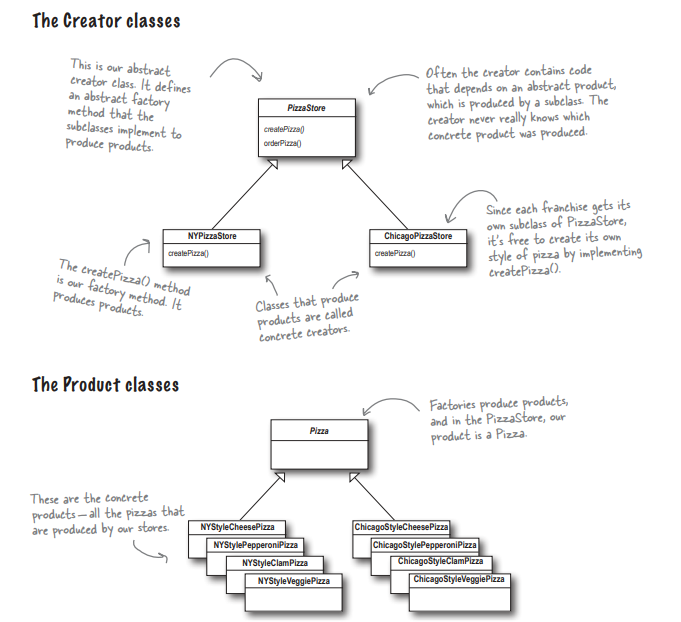
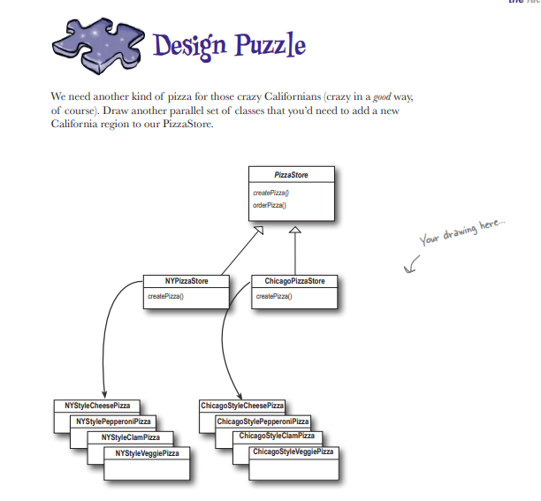

<h1>Factory : </h1>

    <u>creational</u> , provides an interface for <b>creating objects in superclass</b>
     <u>but</u> <b>subclasses to alter the type of objects that will be created</b>.

    میخوام آبجکت های مورد نظرمون رو در یک فکتوری تولید کنیم
    و بجای استفاده مستقیم از یک آبجکت از فکتوری استفاده کنیم که آبجکت ها رو توی خئدش تولید کرده

###🙄🙄🙄🙄🙄 WTF ?
#⬇️ گیج نشو , بیا مثال رو ببین⬇️

<h2>❌الان این مشکل رو داریم❌</h2>

میخوایم توی سوپر کلاسمون یک پیتزا بسازیم و اونطور که میبینید کلی کد رو ریختیم توی فانکشن زیر

 

<h2>✅تقریبا میخوایم به این مرحله برسیم✅</h2>
میخوایم به جایی برسیم که بجای این که اینستنسی از پیتزای مورد نظرمون داشته باشیم
اینستنسی از کارخونه ی اون داشته باشیم که اون کارخونه به ما پیتزای مورد نظر رو بده که استفاده کنیم
 

گفتم تقریبا چون به یک مرحله خیلی بهتری میرسیم ولی فعلا در همین حد تو ذهنتون بمونه

 

<h2>چطوری پیاده سازی کنیم ؟</h2>

##(1) Encapsulate Object Creation
 
یادتونه یک فانکشن داشتیم که با کلی شرط میومد پیتزای مورد نظر رو میساخت ؟
اون رو در مرحله اول جدا کنیم , اصلا تبدیلش کنیم به یه فانکشن دیگه.

 
خود این کار یعنی ساخت یک فکتوری
<kbd>We've got a name for this new object : <u>FACTORY</u></kbd>

### (1-1) Convert creator function to a class named <u>FACTORY</u>
 
حالا واقعا بیایم تبدیلش کنیم به یک کلاس به نام فکتوری
 

## (2) Use Factory in superclass (Client)

بریم ازش استفاده کنیم تو سوپر کلاس

## 🎁تبریک میگم , مفهوم فکتوری رو متوجه شدید , یه بار دیگه بخونید و همین مثال رو با کد پیاده سازی کنید بعدش بیاید یه ذره دیگه کار داریم!🎁

## (3) Allowing the subclasses to decide 

 تصمیم گرفتیم یک اپلیکیشن بزرگ بزنیم که فروشگاه های مختلف داره و هر فروشگاه پیتزا های مختلف
 
با فکتوری این رو میتونی به راحتی پیاده سازی کنی !
<h5>این عکس رو خوب نگاه کن</h5>

کارمون یک مرحله انتزاعی تر شد , حالا میتونیم انواع فروشگاه هم با فکتوری بسازیم!

##پس کلا به دو بخش تقسیم میشه
فروشگاه : Creator/Factory
 
پیتزا ها : Product
 

<h1>تمام !</h1>
<h2>پاشیم بریم کد بزنیم !</h2>

* Example 1 : Pizza Factory
* Example 2 : Message Publisher Factory
* Example 3 : Duck Factory
