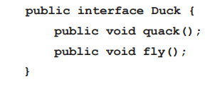
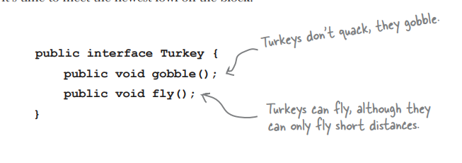
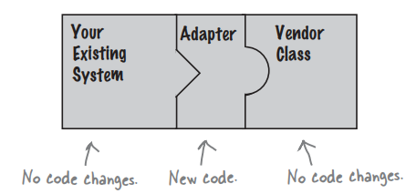

<h1>Adapter : </h1>

> از آداپتر وقتی استفاده میکنیم که کد جدیدی بهمون اضافه میشه ولی اینترفیس متفاوتی داره

👇مثلا یک کلاس برای اردک داریم که این دو فانکشن رو داره

👇حالا یک نوع اردک جدید داریم که اسم فانکشناش فرق داره (اینترفیس متفاوتی داره)

 ###حالا با استفاده از آداپتر کاری میکنیم که اینترفیس جدید هم به راحتی پشتیبانی کنیم , مانند شکل زیر :

