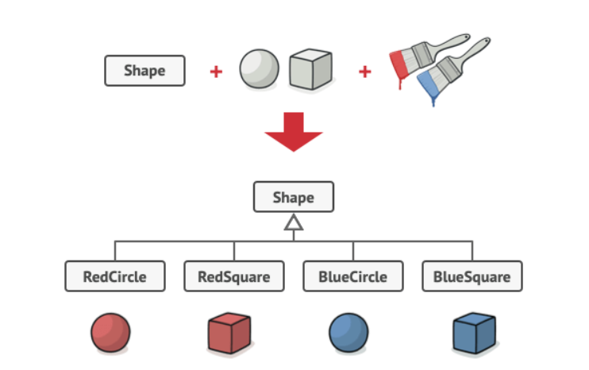
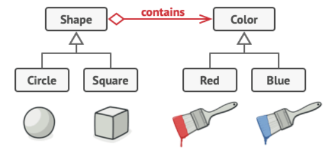

## Bridge🌉
Use the Bridge Pattern to vary not only your
implementations, but also your abstractions.

### کی ها ازش استفاده کنیم

* یک کلاس که دپندنسی های مختلفی داره و خیلی بزرگ شده و میتونیم بحش هاش رو جدا و با بریج آنرا وصل کنیم

* مثل پترن استراتژی میشه تو رانتایم شکل مورد نظر از پیاده سازی رو انتخاب کرد

###❌مشکل زیر رو داریم❌

### ✅با کمک این دیزاین پترن به این مرحله میرسیم✅

>>> Bridge pattern attempts to solve this problem by switching from inheritance to composition

# ما یک پل میسازیم که کلاس های زیر مجموعه به آن اینژکت میشن و از آن استفاده میکنیم
