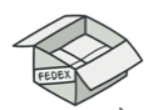
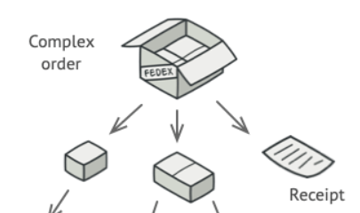
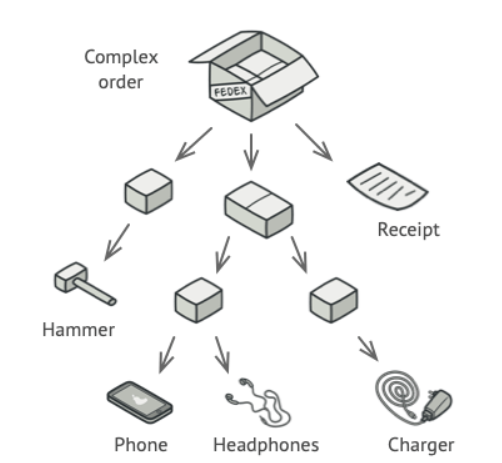
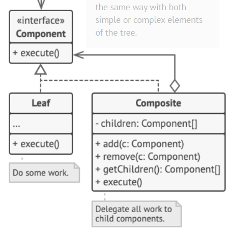

## Composite🌴
> یک روش عالی برای پیاده سازی ساختار های درختی
 
> وقتی میخوای کلاینت از انواع کامپوزیت ها استفاده کنه

### یک جعبه بزرگ رو در نظر بگیرین که بازش نکردیم

### توی این جعبه هم ممکنه جعبه های دیگه باشه هم ممکنه محصول باشه

### باز هم توی جعبه های درونی ممکنه همین باشه و این سلسله مراتب ادامه داره...

> میخوایم جمع کل جعبه ها رو بدست بیاریم

> میخوایم همشون رو توی صفحه رندر کنیم

> میخوایم بهترین پترن رو برای این سلسله مراتب پیدا کنیم 

## ✌کامپوزیت میگه جعبه رو هم محصول فرض کن️✌️
پس پدر را میسازیم و شاخ و برگ رو از اون اکستند میکنیم که در این مثال
* شاخه : جعبه
* برگ : محصول

* تنها تفاوتش اینه که شاخه باید محصول ها رو مپ کنه و عملیاتی که باید رو روشون اجرا کنه
